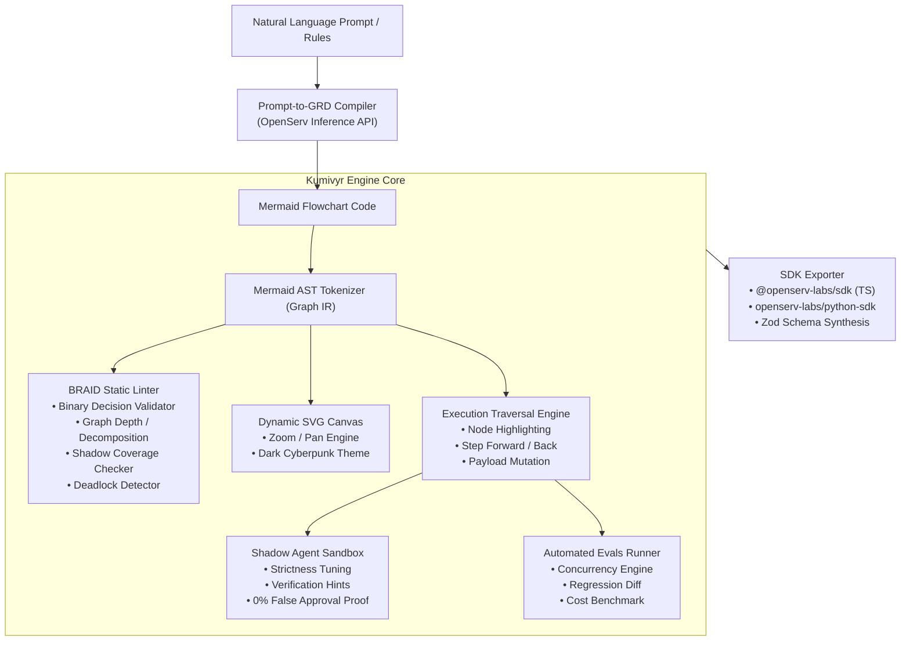

# Kumivyr Technical Architecture Specification

## Overview

**Kumivyr** is a specialized developer workbench, static linter, and visual step-debugger designed specifically for **OpenServ's BRAID (Bounded Reasoning for Autonomous Inference and Decisions)** architecture.

In OpenServ, AI reasoning is not an unconstrained stream of natural language tokens; it is compiled into a **Guided Reasoning Diagram (GRD)**—a deterministic, machine-native graph formatted in Mermaid flowchart syntax. Kumivyr serves as the IDE and verification harness for these graphs.



---

## 1. Data Model & Intermediate Representation (IR)

The core data structure in Kumivyr is the **`GraphIR`**, representing the parsed topology of a Mermaid flowchart.

```typescript
export interface GraphNode {
  id: string;
  label: string;
  type: 'start' | 'process' | 'decision' | 'action' | 'terminal';
  rawShape: string; // e.g. [rect], (round), {rhombus}, ((circle))
  outgoingEdges: string[];
  incomingEdges: string[];
  metadata?: {
    isBinary?: boolean;
    requiresShadow?: boolean;
    subgraphId?: string;
  };
}

export interface GraphEdge {
  id: string;
  fromNode: string;
  toNode: string;
  condition?: string; // e.g. "Yes", "No", "Approved", "Score >= 700"
  isBinary?: boolean;
}

export interface GraphIR {
  nodes: Map<string, GraphNode>;
  edges: GraphEdge[];
  subgraphs: Array<{
    id: string;
    title: string;
    nodeIds: string[];
  }>;
  startNodeId?: string;
  terminalNodeIds: string[];
  metrics: {
    nodeCount: number;
    edgeCount: number;
    maxDepth: number;
    cyclomaticComplexity: number;
  };
}
```

---

## 2. The BRAID Static Linter Engine

The linter evaluates `GraphIR` against architectural rules derived from OpenServ research (arXiv:2512.15959) and enterprise case studies (Neol, ThoughtProof).

### Rule Catalog

| Rule ID | Name | Severity | Description |
| :--- | :--- | :--- | :--- |
| `BRAID-001` | `enforce-binary-decisions` | **Critical** | Branching nodes must have exactly 2 outcomes (Yes/No, Pass/Fail). Multi-way ambiguity causes lightweight models to drift. |
| `BRAID-002` | `max-graph-depth` | **Warning** | Graphs with depth > 7 or > 12 nodes lose thread coherence. Must be decomposed into subgraphs. |
| `BRAID-003` | `terminal-safety` | **Critical** | Every reachable execution branch must culminate in an explicit terminal node. Deadlocks and cycles without exit conditions fail. |
| `BRAID-004` | `shadow-agent-gate` | **Warning** | Any tool execution or financial transaction node must be preceded by a verification gate. |
| `BRAID-005` | `safe-node-naming` | **Info** | Node identifiers must be alphanumeric with no unescaped reserved symbols. |

### Health Score Formula
The **Graph Health Score** is computed out of 100:
$$\text{Score} = 100 - (\text{Critical} \times 25) - (\text{Warning} \times 10) - (\text{Info} \times 2)$$
Clamped at $[0, 100]$.

---

## 3. Interactive Execution & Debugging Runtime

Kumivyr simulates graph traversal without requiring a full live cloud deployment:

1. **State Machine:**
   * States: `IDLE` $\rightarrow$ `RUNNING` $\rightarrow$ `STEPPED` $\rightarrow$ `PAUSED` $\rightarrow$ `FINISHED`.
2. **Step Execution:**
   * Given `currentNodeId` and an input payload:
     * If node is a `decision`, evaluates edge condition against payload variables.
     * Transitions active pointer to `targetNodeId`.
     * Injects neon highlight class to target SVG node element.
     * Appends step record to `executionTrace`.
3. **Shadow Gate Checkpoint:**
   * If target node is flagged `requiresShadow`, triggers simulated **Shadow Validation Agent**.
   * Evaluates input payload against verification criteria.
   * If invalid, halts transition, sets status `BLOCKED_BY_SHADOW`, and prevents unauthorized execution.

---

## 4. Automated Evals & Benchmark Engine

Kumivyr allows regression testing reasoning graphs against arrays of test cases:
* **Test Case Definition:**
  ```typescript
  export interface EvalTestCase {
    id: string;
    title: string;
    category: 'compliance' | 'edge-case' | 'risk' | 'smoke';
    payload: Record<string, any>;
    expectedTerminalNode: string;
    forbiddenNodes?: string[];
  }
  ```
* **Metrics Reported:**
  * **Pass Rate:** Percentage of test cases ending at expected terminal node.
  * **False Approval Rate:** Asserts $0\%$ (guaranteed by shadow verification).
  * **Estimated Cost per Call:** $0.0006 for `gpt-5.4-nano` / `serv-nano` vs. $0.06 for frontier baseline (100x cost reduction).
